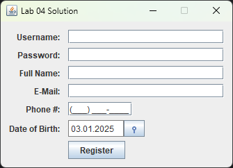
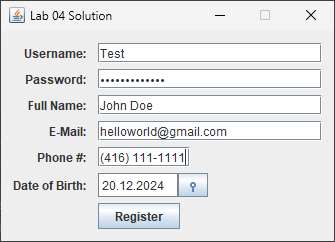

# Lab 4 - GUI Part 1

CSCI 2020U: Software Systems Development and Integration

## Overview
In this lab, you’ll develop a Java program with a user interface, using JSwing. It is recommended that you do NOT use the SwingUIDesigner.

## Tasks
- Create a registration application, that asks the user for the following information:
  - Username (a string)
  - Password (a string)
  - Full name (a string)
  - E-Mail address (a string)
  - Phone number (a string, format: (000) 000-0000)
  - Date of birth (a date)
- Organize the fields for this registration UI into a series of rows, each row having a label, the control
  most appropriate for that field
- Include a button, ‘Register’, that when clicked will print all fields’ values to the console
- Implement a data picker by installing [SwingX](https://mvnrepository.com/artifact/org.swinglabs/swingx/1.6.1) via Maven. After adding the dependency in `pom.xml` and importing the classes, you can now create `JXDatePicker` and treat it as any JSwing component.

```java
import org.jdesktop.swingx.JXDatePicker;
JXDatePicker datePicker = new JXDatePicker();
```
 
***Note***: See figure for an example of the basic final product. While the components are obligatory,
  feel free to improve the aesthetics.

<div align="center">
  
  
</div>

>The auto grader will not check for correctness, this will be manually done.

## How to Submit

### In session

(Preferably)

- Show your local and remote repositories to the TA to prove that you have finished this lab.

### After lab hours

(1 week to submit - before your next lab session)

- Link to your GitHub repository on Canvas
- Screenshots of the command line terminal
- Screenshots of the UI
- Add screenshots to `README.md`

The TA can provide oral feedback if you do not receive full marks for any lab assignment, but it is most
appropriate to ask the TA for this feedback in a timely fashion (i.e. ask now, not at the end of the term).
